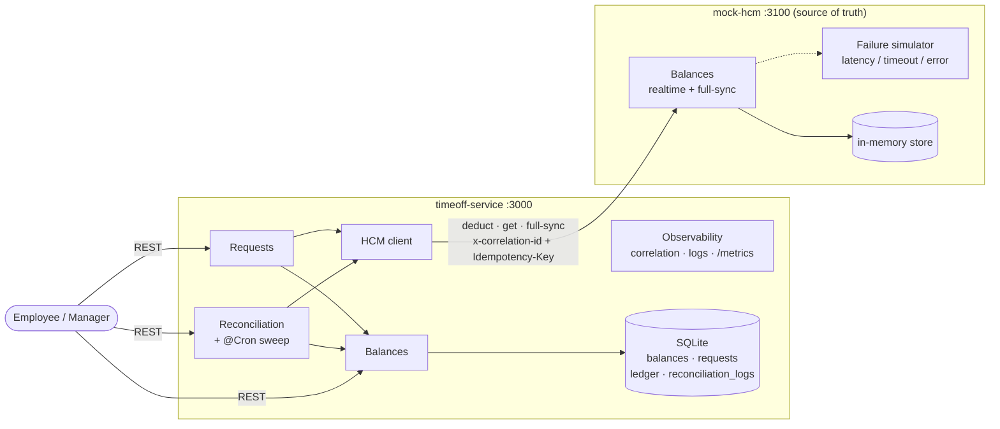
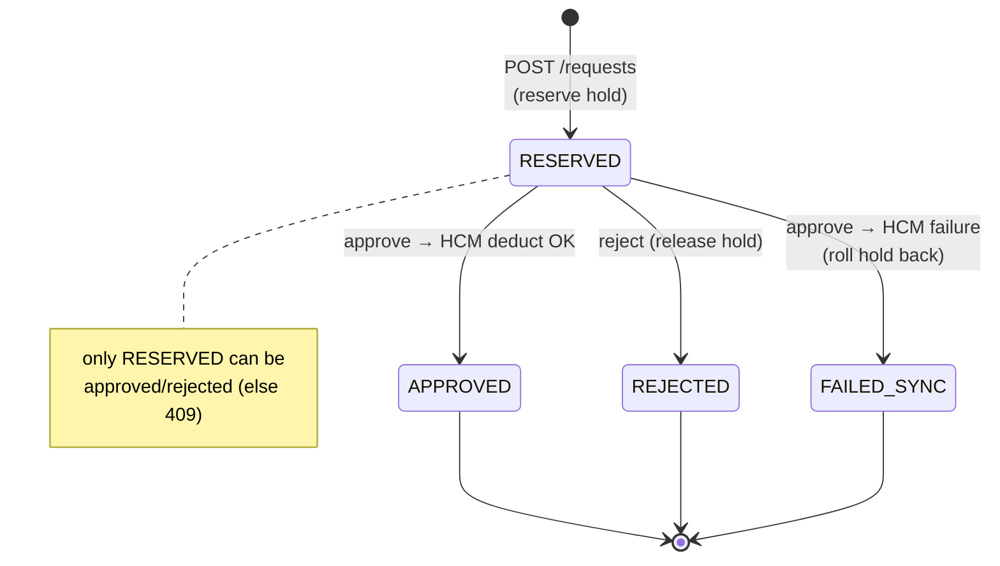
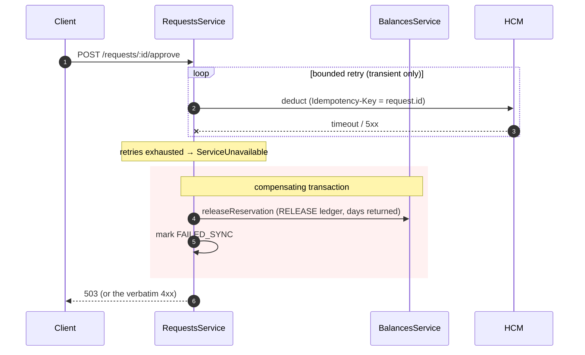
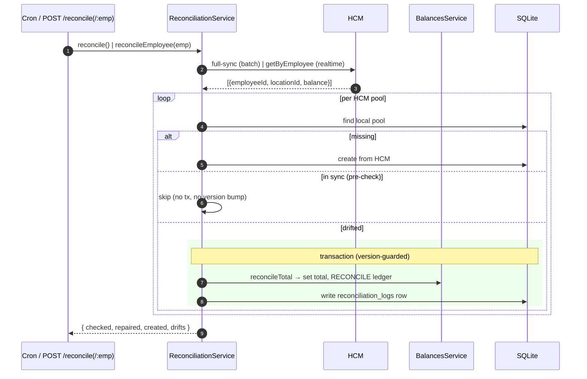
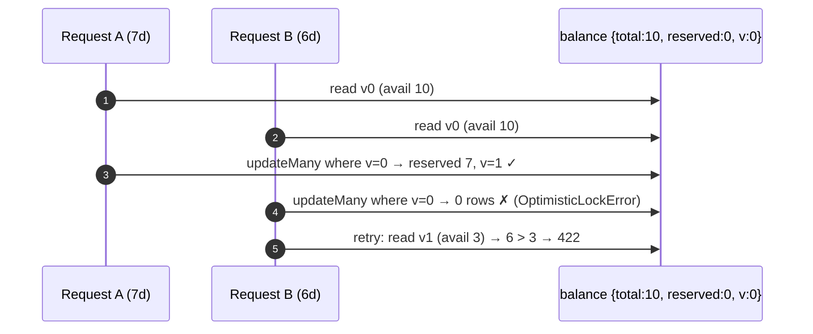

# Architecture

Visual companion to the [TRD](./TRD.md). Diagrams are [Mermaid](https://mermaid.js.org/)
and render on GitHub.

## 1. System context

Two independently-deployed services; the mock HCM is a stand-in for the real
external HR system and is deliberately not wired to the time-off database.



## 2. Request lifecycle — state machine



## 3. Happy path — request then approve

```mermaid
sequenceDiagram
  autonumber
  participant C as Client
  participant R as RequestsService
  participant B as BalancesService
  participant DB as SQLite
  participant H as HCM

  C->>R: POST /requests {employeeId, locationId, days}
  rect rgb(238,246,255)
  note over R,DB: single transaction
  R->>B: resolveBalance(employeeId, locationId)
  B->>DB: findUnique (404 if no pool)
  R->>B: reserveBalance (available ≥ days? else 422)
  B->>DB: guarded update reserved+=days, version++ ; RESERVE ledger
  end
  R-->>C: 201 RESERVED

  C->>R: POST /requests/:id/approve
  R->>H: deduct {employeeId, locationId, days, Idempotency-Key}
  H-->>R: 200 {balance}
  R->>R: assertSaneHcmBalance(result)
  rect rgb(238,246,255)
  note over R,DB: single transaction
  R->>B: commitDeduction (total-=days, reserved-=days, version++) ; DEDUCT ledger
  end
  R-->>C: 200 APPROVED
```

## 4. Failure path — compensation

When the deduct can't be confirmed, the hold is rolled back and the request is
marked `FAILED_SYNC`. A deterministic HCM `4xx` is surfaced verbatim; a transient
fault (retries exhausted) becomes `503`.



## 5. Reconciliation — drift repair



> The HCM is authoritative for `totalBalance` only; local `reservedBalance` (pending
> holds) is never reconciled. A user write racing a repair trips the optimistic-lock
> guard and is skipped (settled on the next run).

## 6. Concurrency guard

Two requests against the same pool can't both reserve: the conditional update is
keyed on the `version` each read, so the loser touches zero rows and retries on
fresh data — into its own `422`/`409`.


